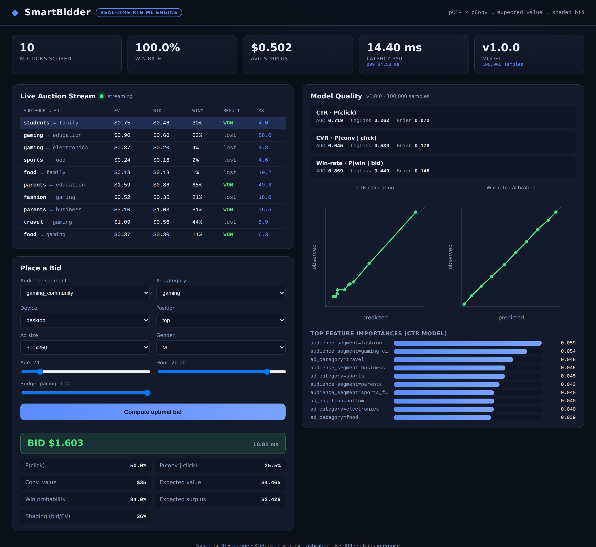
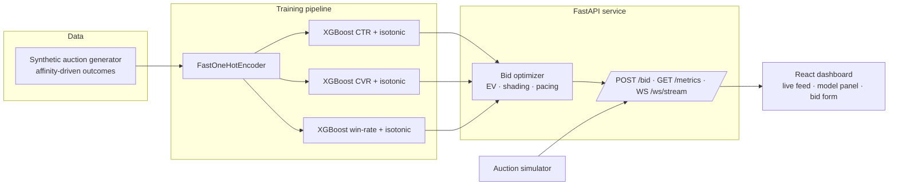

<div align="center">

# ◆ SmartBidder

### A real-time machine-learning engine for optimizing ad bids and audience matching

Predicts click & conversion probabilities for every ad impression, turns them into an
**expected value**, and computes the **optimal shaded bid** — the same decision a real
demand-side platform (DSP) makes millions of times per second.

[](https://github.com/bowiecooper/SmartBidder/actions/workflows/ci.yml)
&nbsp;·&nbsp; **[Live demo →](https://REPLACE_ME)** &nbsp;·&nbsp; FastAPI · XGBoost · React



</div>

---

## What it does

Real-time bidding (RTB) is the auction that runs in the ~10&nbsp;ms between a page loading
and an ad appearing. For each impression a bidder must decide, instantly, **whether to bid
and how much**. SmartBidder implements that decision end to end:

1. **Predict** — two calibrated models estimate `P(click | context)` and
   `P(conversion | click, context)` from the auction context (audience segment, ad category,
   device, placement, time, demographics).
2. **Value** — combine them into the expected value of the impression:
   `EV = P(click) · P(conversion) · value_per_conversion`.
3. **Bid** — a learned **win-rate model** gives `P(win | bid)`, and the optimizer chooses the
   bid that maximizes expected surplus `P(win | bid) · (EV − bid)`. The result is a bid
   **shaded below** true value — exactly how production DSPs capture margin.

A streaming simulator replays auctions over a WebSocket so the dashboard shows the engine
making live decisions, with model-quality and latency telemetry.

## Why it's interesting (engineering highlights)

- **Decisions, not just predictions.** The headline isn't a classifier — it's an
  expected-value bid optimizer with **bid shading** and **budget pacing**, grounded in auction
  economics.
- **Calibration matters.** Probabilities are isotonically calibrated, because the optimizer
  *multiplies* them as expected value — a high-AUC-but-miscalibrated model would bid wrong.
- **Genuinely real-time.** A hand-rolled NumPy featurizer + native XGBoost `inplace_predict`
  replaces scikit-learn's per-call overhead, taking a full bid decision (3 model calls + a
  40-point bid-grid search) from ~60&nbsp;ms to **~2.5&nbsp;ms p50 / <7&nbsp;ms p99**.
- **Learnable-by-design synthetic data.** A latent segment↔category **affinity matrix** drives
  outcomes, so "audience matching" is a real, measurable signal — the CTR model's top features
  are the audience-segment encodings.
- **Honest metrics.** AUCs land in realistic adtech ranges (below), not a suspicious 1.0.

## Model performance

Trained on 100,000 synthetic impressions (held-out test split):

| Model | Target | AUC | Log-loss | Brier |
|-------|--------|----:|---------:|------:|
| CTR | `P(click \| context)` | **0.72** | 0.262 | 0.072 |
| CVR | `P(conversion \| click)` | **0.64** | 0.539 | 0.178 |
| Win-rate | `P(win \| bid, context)` | **0.87** | 0.449 | 0.148 |

Simulated bidding behavior: bids on ~91% of auctions, **~29% win rate** among bids, with an
average **bid/EV ratio of ~0.63** (clear, profitable bid shading).

## Architecture



## Quickstart

### Run with Docker (whole stack)

```bash
docker compose up --build
# dashboard → http://localhost:3000   ·   API docs → http://localhost:8000/docs
```

### Run locally

```bash
# Backend
python -m venv .venv && source .venv/bin/activate
pip install -r requirements.txt
cd backend
python -m smartbidder.train --samples 100000     # trains + saves model artifacts
uvicorn smartbidder.api:app --reload              # http://localhost:8000

# Frontend (in another terminal)
cd frontend
npm install
npm start                                         # http://localhost:3000
```

### Try the API

```bash
curl -X POST http://localhost:8000/bid -H 'Content-Type: application/json' -d '{
  "audience_segment": "travel_enthusiasts", "ad_category": "travel",
  "device_type": "desktop", "ad_position": "top", "ad_size": "300x250",
  "user_gender": "F", "user_age": 40, "hour_of_day": 20, "day_of_week": 5
}'
# → {"bid": 2.49, "p_ctr": 0.45, "p_conversion": 0.48, "expected_value": 19.41,
#    "win_probability": 0.99, "expected_surplus": 16.70, "latency_ms": 4.8, ...}
```

### Test

```bash
cd backend && python -m pytest -q          # engine + economics + API contract
cd frontend && npm run build               # production build
```

## Project structure

```
backend/
  data/data_generator.py        affinity-driven synthetic auction generator
  smartbidder/
    features.py                 shared feature engineering (no train/serve skew)
    encoder.py                  fast NumPy one-hot featurizer (µs-level)
    train.py                    trains CTR / CVR / win-rate + isotonic calibration
    bidder.py                   expected-value bid optimizer with shading + pacing
    model_store.py              warm in-memory models for low-latency serving
    api.py                      FastAPI: /bid, /metrics, /options, /health, /ws/stream
    simulator.py                live auction-stream generator
  tests/                        pytest suite
frontend/src/                   React dashboard (KPIs, live feed, model panel, bid form)
docker-compose.yml · .github/workflows/ci.yml
```

## Tech stack

**ML/Data** Python · XGBoost · scikit-learn (isotonic calibration) · NumPy · pandas ·
**Serving** FastAPI · Uvicorn · WebSockets · Pydantic · **Frontend** React · custom SVG charts ·
**Infra** Docker Compose · GitHub Actions

## Notes

- All data is **synthetic** — generated with an interpretable latent model, no real user data.
- The hosted backend uses a free tier that cold-starts after inactivity; the first request
  on the live demo may take ~30&nbsp;s to wake the server.
